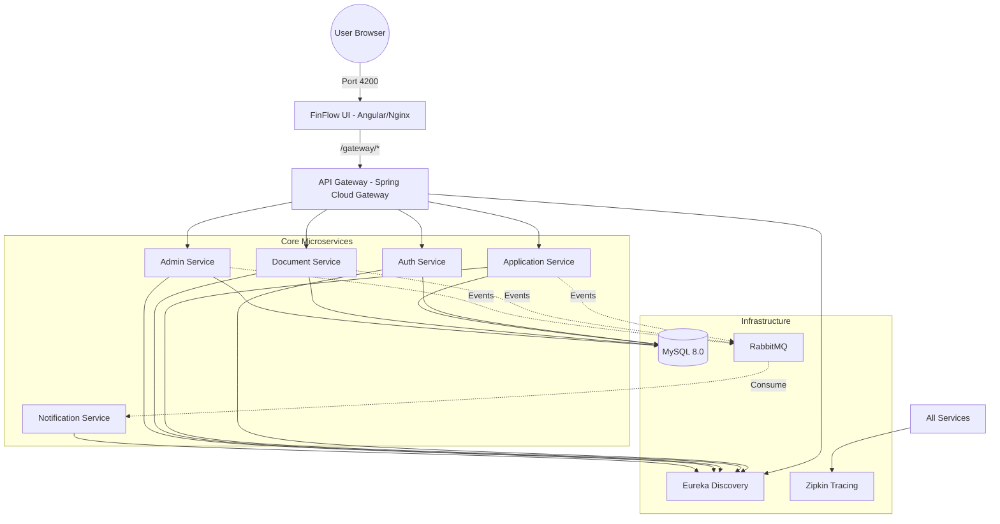

# 🌊 FinFlow: Modern Loan Management Ecosystem

[](https://spring.io/projects/spring-boot)
[](https://angular.io/)
[](https://www.docker.com/)
[](LICENSE)

**FinFlow** is a production-grade, microservices-based loan processing system designed for scalability, observability, and a premium user experience. It handles the entire loan lifecycle—from applicant registration and document submission to administrative review and notification.

---

## 🏗️ System Architecture

FinFlow utilizes a modern microservices architecture with centralized routing, service discovery, and event-driven communication.



---

## 🚀 Key Features

- **🔐 Secure Authentication**: JWT-based security with role-based access control (RBAC).
- **📝 Loan Lifecycle**: Draft, submit, and track loan applications with real-time status updates.
- **📁 Document Management**: Robust file upload system with association to loan applications.
- **👔 Admin Dashboard**: Comprehensive oversight for loan officers to review and manage applications.
- **🔔 Real-time Notifications**: Event-driven alerts via RabbitMQ for status changes and reminders.
- **🔍 Full Observability**: Distributed tracing with Zipkin and integrated health monitoring.

---

## 🛠️ Technology Stack

| Layer | Technology |
| :--- | :--- |
| **Frontend** | Angular 18+, Material UI, Nginx |
| **Backend** | Java 17, Spring Boot 3.x, Spring Data JPA |
| **API Gateway** | Spring Cloud Gateway |
| **Service Discovery** | Spring Cloud Netflix Eureka |
| **Messaging** | RabbitMQ (Asynchronous processing) |
| **Database** | MySQL 8.0 |
| **Tracing** | OpenZipkin |
| **DevOps** | Docker, Docker Compose |

---

## 🚦 Getting Started

### Prerequisites
- [Docker Desktop](https://www.docker.com/products/docker-desktop/)
- [Maven 3.8+](https://maven.apache.org/download.cgi) (optional, for local development)

### Quick Start (Docker)
1. **Clone the repository**:
   ```bash
   git clone https://github.com/your-username/finflow.git
   cd finflow
   ```

2. **Launch the ecosystem**:
   ```bash
   docker-compose up -d --build
   ```

3. **Access the application**:
   - **Frontend**: [http://localhost:4200](http://localhost:4200)
   - **API Gateway**: [http://localhost:8090](http://localhost:8090)
   - **Eureka Dashboard**: [http://localhost:8761](http://localhost:8761)
   - **Zipkin Dashboard**: [http://localhost:9411](http://localhost:9411)

---

## 📖 API Documentation

Each service exposes its own Swagger documentation. You can access the unified documentation through the Gateway:

- **Swagger UI**: `http://localhost:8090/swagger-ui.html`
- **Individual Service Docs**:
  - Auth: `/api/auth/api-docs`
  - Application: `/api/applications/api-docs`
  - Document: `/api/documents/api-docs`
  - Admin: `/api/admin/api-docs`

---

## ⚙️ Environment Configuration

The system uses a `.env` file for configuration. Key variables include:

- `FINFLOW_JWT_SECRET`: Secret key for JWT signing.
- `SPRING_DATASOURCE_URL`: MySQL connection string.
- `SPRING_RABBITMQ_HOST`: RabbitMQ broker host.

---

## 🤝 Contributing

Contributions are welcome! Please read our [Contributing Guidelines](CONTRIBUTING.md) for more details.

---

Developed with ❤️ by **Ayush Chahal**
