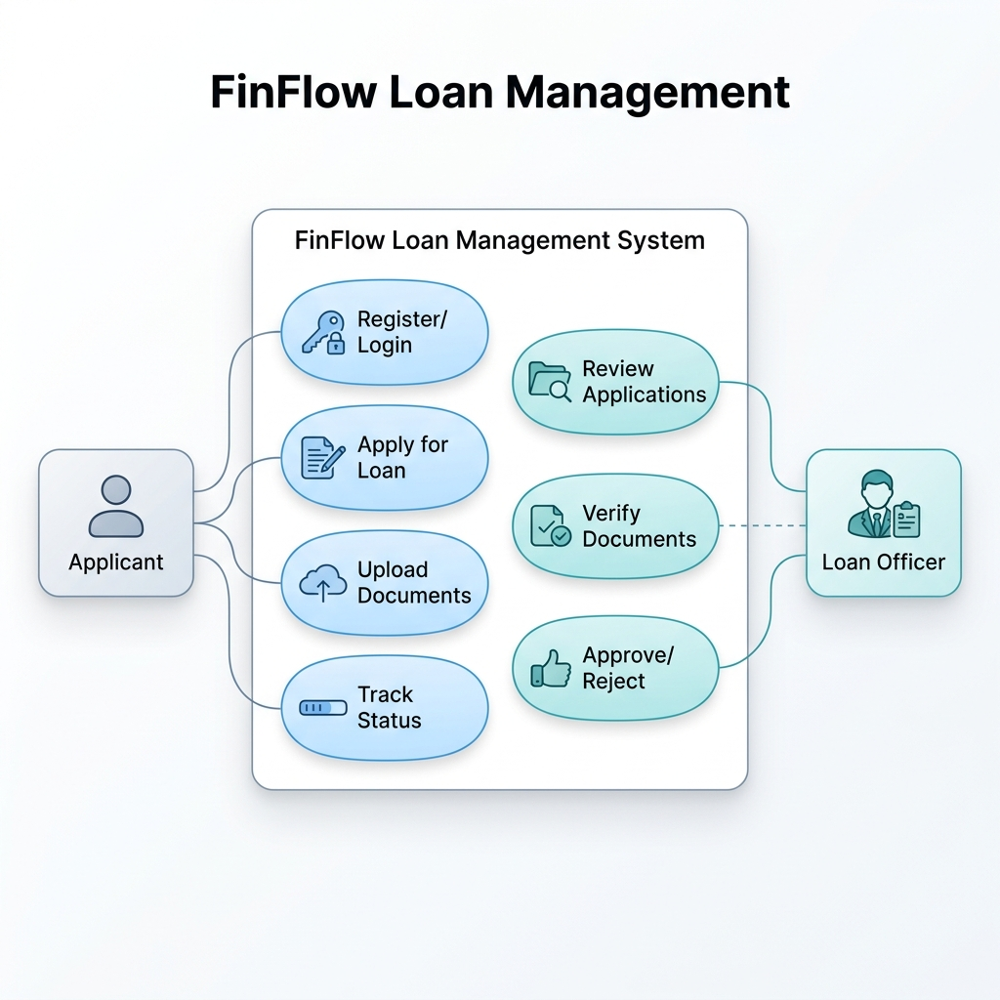
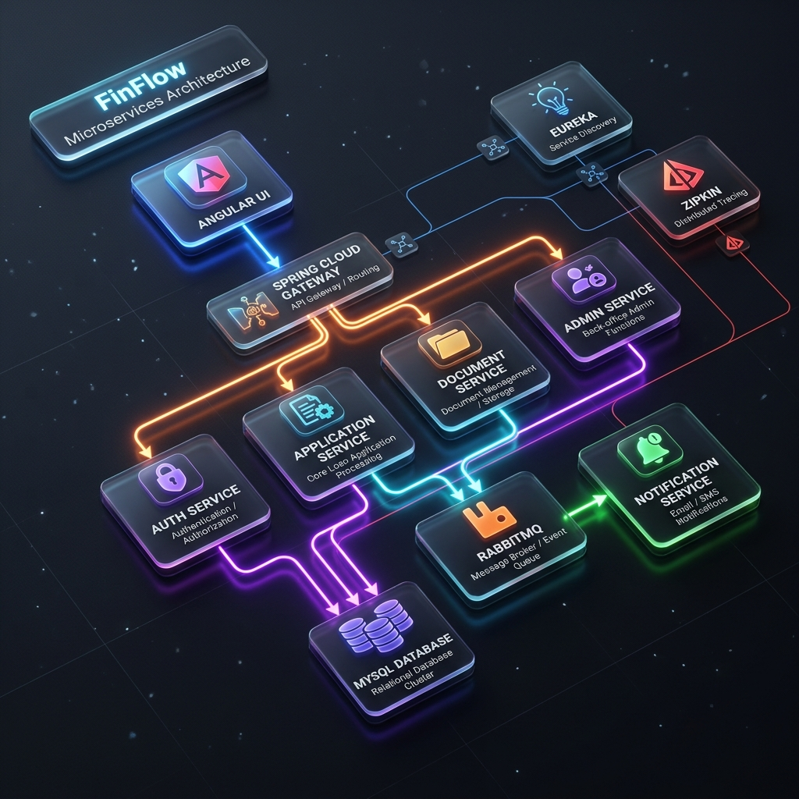
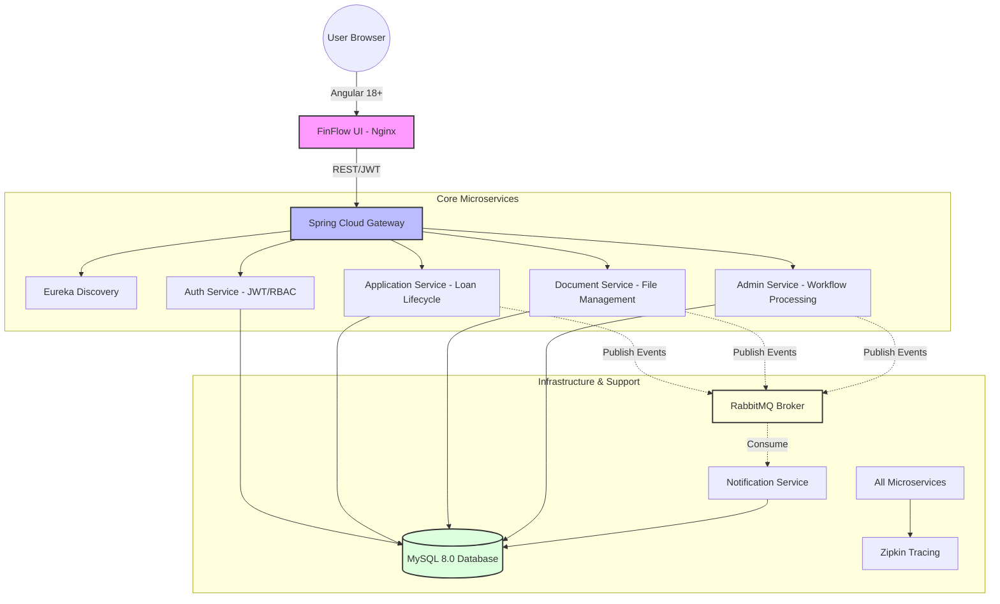
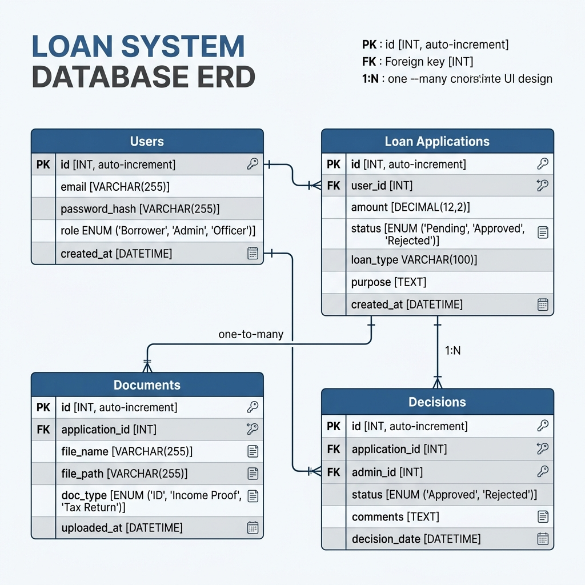
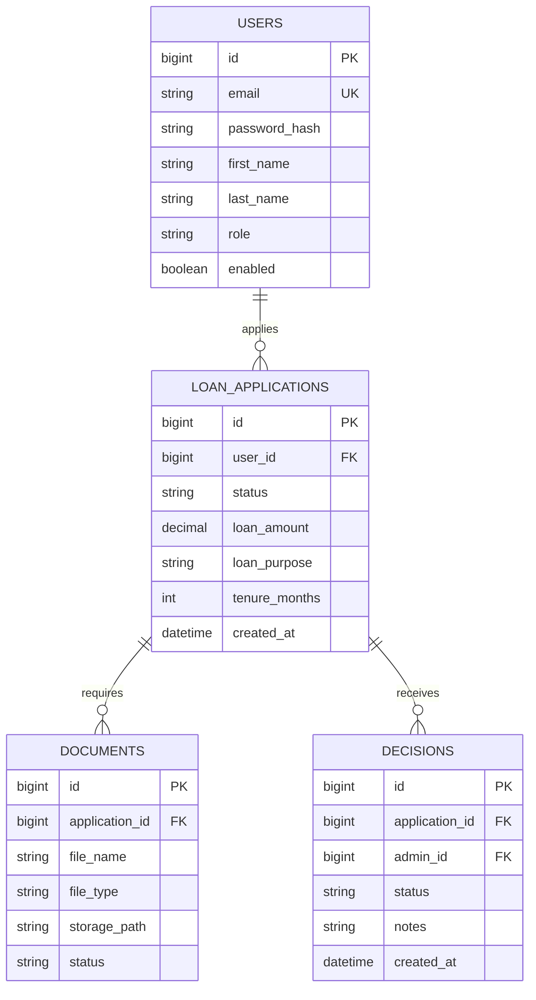
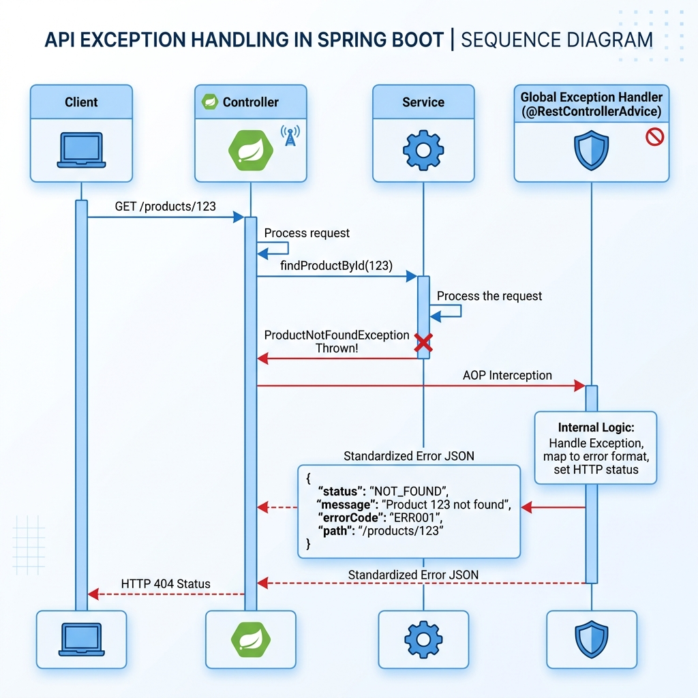
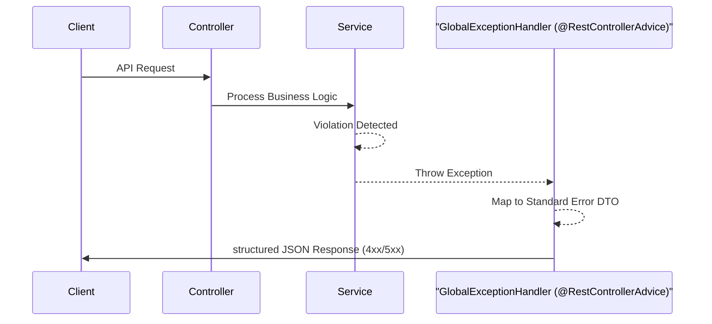

# FinFlow Design Documentation

This document provides a visual representation of the FinFlow Loan Management System's functional requirements, system architecture, and data model.

---

## 1. Use Case Diagram

The Use Case diagram illustrates the primary interactions between the actors (**Applicant**, **Admin**) and the core functionalities of the FinFlow ecosystem.



### Mermaid Source
```mermaid
useCaseDiagram
    actor Applicant as "Applicant (User)"
    actor Admin as "Loan Officer (Admin)"
    
    package "FinFlow Ecosystem" {
        usecase UC1 as "Secure Login/Registration"
        usecase UC2 as "Create Loan Application"
        usecase UC3 as "Upload Required Documents"
        usecase UC4 as "Track Application Status"
        usecase UC5 as "Receive Real-time Alerts"
        
        usecase UC6 as "View All Applications"
        usecase UC7 as "Review & Verify Documents"
        usecase UC8 as "Approve/Reject Application"
        usecase UC9 as "Monitor System Health (Zipkin/Eureka)"
    }
    
    Applicant --> UC1
    Applicant --> UC2
    Applicant --> UC3
    Applicant --> UC4
    Applicant --> UC5
    
    Admin --> UC1
    Admin --> UC6
    Admin --> UC7
    Admin --> UC8
    Admin --> UC9
```

---

## 2. Architecture Diagram

FinFlow follows a **Microservices Architecture** with a centralized API Gateway, Service Discovery, and an Event-Driven notification system.



### Mermaid Source


---

## 3. Database Diagram (Logical ERD)

The following diagram represents the logical data model across the various microservices.



### Mermaid Source


---

## 4. Exception Handling Design

FinFlow implements a **Global Exception Handling** strategy using Spring Boot's `@RestControllerAdvice`. This ensures that every microservice returns a consistent error structure, regardless of the failure type.



### Exception Workflow
1. **Service Layer**: Throws a custom or standard exception (e.g., `LoanNotFoundException`).
2. **Advice Layer**: The `GlobalExceptionHandler` intercepts the exception before it reaches the client.
3. **DTO Transformation**: The exception is mapped to a standardized `ApiResponse` DTO.
4. **Client Response**: A structured JSON response with a relevant HTTP status code (4xx/5xx) is returned.

### Mermaid Sequence Diagram


### Standard Error Structure
Every error follows this uniform format:
```json
{
  "success": false,
  "message": "Specific error message here",
  "data": null
}
```

---

## 🛠️ Design Summary

- **Architecture**: Microservices based on Spring Boot 3.x and Spring Cloud.
- **Frontend**: Premium UI developed with Angular 18+, following a modern glassmorphism aesthetic.
- **Security**: JWT-based stateless authentication with role-based routing at both Gateway and UI levels.
- **Messaging**: Asynchronous notifications triggered by status changes in the application and document lifecycles.
- **Observability**: Centralized logging and distributed tracing for debugging complex distributed workflows.
- **Error Handling**: Standardized `@RestControllerAdvice` providing uniform JSON responses across all services.
